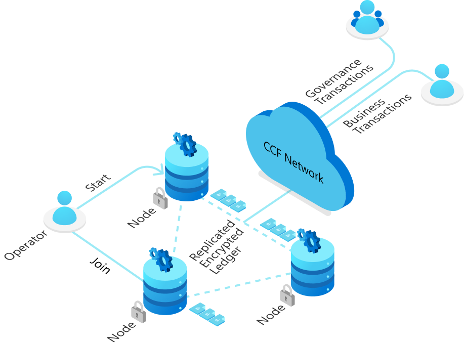

# The Confidential Consortium Framework  

The Confidential Consortium Framework (CCF) is an open-source framework for building a new category of secure, highly available, and performant applications that focus on multi-party compute and data.

## Get Started with CCF

- Read the [CCF overview](https://microsoft.github.io/CCF/main/overview/index.html) and become familiar with the [core concepts](https://microsoft.github.io/CCF/main/overview/what_is_ccf.html)
- [Install](https://microsoft.github.io/CCF/main/build_apps/install_bin.html) CCF on Linux
- Become familiar with the CCF core developer API with the [template CCF app](https://github.com/microsoft/ccf-app-template)
- Quickly build and run [sample CCF apps](https://github.com/microsoft/ccf-app-samples)
- [Build new CCF applications](https://microsoft.github.io/CCF/main/build_apps/index.html) in TypeScript/JavaScript or C++

## Contribute

- [Contribute](https://microsoft.github.io/CCF/main/contribute) to this repository, following the [contribution guidelines](.github/CONTRIBUTING.md)
- Submit [bugs](https://github.com/microsoft/CCF/issues/new?assignees=&labels=bug&template=bug_report.md&title=) and [feature requests](https://github.com/microsoft/CCF/issues/new?assignees=&labels=enhancement&template=feature_request.md&title=)
- Start a [discussion](https://github.com/microsoft/CCF/discussions/new) to ask a question or propose an idea

## Learn More

- Browse the [documentation](https://microsoft.github.io/CCF/)
- Read the [Research Papers](https://microsoft.github.io/CCF/main/research)

## Pure Lean trace validation (recent refactor)

This repository includes a pure-Lean translation of the Veil consistency model and a trace validator. A recent refactor (branch `vl-consistency`) makes the canonical Lean model executable and simplifies trace replay:

- Model.State now stores relations as Bool and the ten canonical transition functions are executable. Trace replay (lean/CCFConsistency/Trace.lean) calls those exact canonical transitions directly; there is no separate "ConcreteState" mirror or duplicated transitions.
- The trace generator (lean/trace_validation.py) still reuses the Veil planner (veil/trace_validation.py) to parse NDJSON traces, reconstruct unlogged ledger/view events, and emit a typed list of TraceAction constructors.
- Generated Lean modules now prove only reachability: a successful replay produces `Reachable final`. The general deductive proofs remain in `CCFConsistency.Proofs` (`reachableProved`) and are the authoritative property theorems. Trace validation therefore checks transition conformance and reachability only (much faster) and does not re-evaluate the full set of quantified properties at every concrete state.
- The generated reachability proofs are kernel-checked and audited for transitive `sorryAx` or native-evaluation dependencies.

Why this matters:

- Avoiding full property re-evaluation for each concrete state dramatically speeds up replay. On the real 73-event / 80-action trace the pure-Lean reachability check completes in about **16 seconds** on a native WSL Linux environment (peak ~4 GB RSS). Previously, re-evaluating properties at every state took minutes to tens of minutes depending on configuration.

Quick validation commands (from the repo root):

- Validate with Veil: `python3 veil/trace_validation.py build/consistency/trace.ndjson --validate`
- Validate with pure Lean: `python3 lean/trace_validation.py build/consistency/trace.ndjson --validate`

Notes:

- Run Lean/Lake only from a native WSL filesystem (do not build under `/mnt/c`).
- The deductive proofs (`CCFConsistency.Proofs`) are still the source of truth for properties; trace validation shows an implementation trace follows the proved transition system and yields a reachable state.

## Third-party components

We rely on several open source third-party components, attributed under [THIRD_PARTY_NOTICES](THIRD_PARTY_NOTICES.txt).

## Contributing

This project welcomes contributions and suggestions. Please see the [Contribution guidelines](.github/CONTRIBUTING.md).
